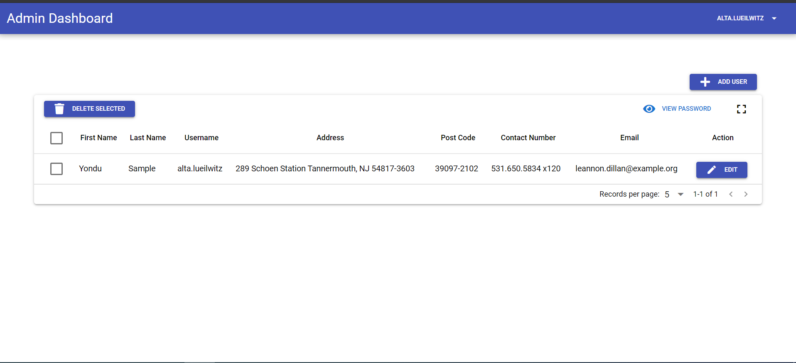

# Features
* Laravel 7
* Vue + VueRouter + Vuex + VueI18n + ESlint
* Quasar Framework
* Login, CRUD
* Authentication with JWT
# Installation
 ## Requirements
 
 Install Node Js
 * https://nodejs.org/en/
 
 Install Vue Cli and Quasar Cli globally.
 * `npm install -g @vue/cli`
 * `npm install -g @quasar/cli`
 
 Install Apache Server (Laragon Full)
 * https://laragon.org/download/
 
 ## Project Setup
 Clone the project to laragon/www
 * git clone https://github.com/nethkenn/yonduexam.git
 
 After cloning, Start laragon. Laragon will detect if there's a new project and it will automatically set Apache Configuration, Host file.
 
 Go to `\laragon\etc\apache2\sites-enabled` and find `auto.yonduexam.test.conf`. We need to point the laravel app to `backend`. Open and edit the following lines:
 * `DocumentRoot "C:/laragon/www/yonduexam/"` to `DocumentRoot "C:/laragon/www/yonduexam/backend/public"`
 * `<Directory "C:/laragon/www/yonduexam/">` to `<Directory "C:/laragon/www/yonduexam/backend/public">`
 
 After editing the file, save it and restart the laragon. Just click the `Stop` and `Start All` again.
 
 Open the link to your browser `http://yonduexam.test/adminer/` and login with the following credentials:
 * `username : root`
 * `password :`
 
 If the following credentials doesn' work, just change the `root` password in laragon. After log in check if database `yonduexam` exist, if not create it manually.
 
 
 Open the project with your code editor.
 * Rename `.env.example` to `.env`. 
 * Go to .env and change the value of `DB_DATABASE`, from **laravel** to **yonduexam**. If you change the `root password` of MYSQL change the `DB_PASSWORD` also.
 
 
 Go to the **terminal** and change the directory to `C:\laragon\www\yonduexam\backend`
 
 * Run **composer update**
 * Run **php artisan key:generate**
 * Run **php artisan jwt:secret**
 * Run **php artisan migrate**
 
  Go to the **terminal** and change the directory to `C:\laragon\www\yonduexam\frontend`

 * Run **npm install**
 
 # Development
 
 Go to the **terminal** and change the directory to `C:\laragon\www\yonduexam\frontend`
 
 * Run **quasar dev**
 
 **NOTE**
 
 For the sample login credentials just use **php artisan db:seed** on the backend (laravel) to create dummy data.
 
 All password created by `seeding` is **password** by default and for the `username` just go to http://yonduexam.test/adminer/ and go to the `users` table and look for the `username` there.
 
